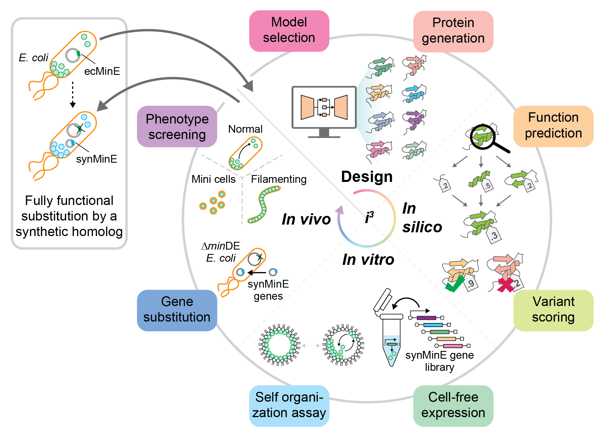

<h1 align="center">synMinE</h1>
<p align="center"><i>Code for the paper <b>"Machine Learning-Aided Design and Screening of an Emergent Protein Function in Synthetic Cells"</b> by Shunshi Kohyama, Béla P. Frohn, Leon Babl and Petra Schwille, published in TBD.</i></p>
<p align="center">
    
</p>

## Abstract
Recently, utilization of machine learning (ML) has led to astonishing progress in computational protein design, bringing into reach the targeted engineering of proteins for industrial and biomedical applications. However, the design of proteins for emergent functions of core relevance to cells, such as the ability to spatiotemporally self-organize and thereby structure the cellular space, is still extremely challenging. While on the generative side conditional generative models and multi-state design are on the rise, for emergent functions there is a lack of tailored screening methods as typically needed in a protein design project, both computational and experimental. Here we describe a proof-of-principle of how such screening, <i>in silico</i> and <i>in vitro</i>, can be achieved for novel ML-generated variants of a protein that forms intracellular spatiotemporal patterns. For computational screening we use a structure-based divide-and-conquer approach to find the most promising candidates, while for the subsequent <i>in vitro</i> screening we use synthetic cell-mimics as established by Bottom-Up Synthetic Biology. We then show that the best screened candidate can indeed completely substitute the wildtype gene in <i>Escherichia coli</i>. These results raise great hopes for the next level of synthetic biology, where ML-designed synthetic proteins will be used to engineer cellular functions.

## Repository Structure
The repository contains five directories: 
- [Data](https://github.com/BelaFrohn/syninE/Data): Containing all sequences, predicted structures, scores and the model weights. 
- [ProteinGeneration](https://github.com/BelaFrohn/syninE/ProteinGeneration): The code used to geenrate novel MinE-like sequences. 
- [insilicoScoring](https://github.com/BelaFrohn/syninE/insilicoScoring): The pipeline used to score the generated sequences <i>in silico</i>. 
- [Analysis](https://github.com/BelaFrohn/syninE/Analysis): The code used to analyse <i>in vitro</i> imaging data, a custom Fiji plugin. 
- [PostHocAnalysis](https://github.com/BelaFrohn/syninE/PostHocAnalysis): The jupyter notebook and data used to analyse the <i>in silico</i> scores after unblinding the <i>in vitro</i> results. 


## License
[MIT License](https://github.com/BelaFrohn/syninE/LICENSE)

## Citation
```
@ARTICLE
{TODO,
author={Kohyama, Shunshi and Frohn, Béla P. and Babl, Leon and Schwille, Petra},
journal={TBD},
title={Machine Learning-Aided Design and Screening of an Emergent Protein Function in Synthetic Cells},
year={2024},
volume={},
number={},
pages={},
doi={TBD}}
```